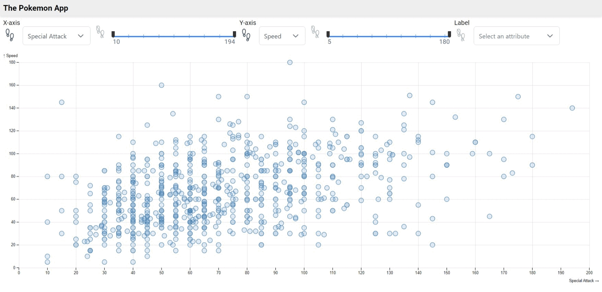
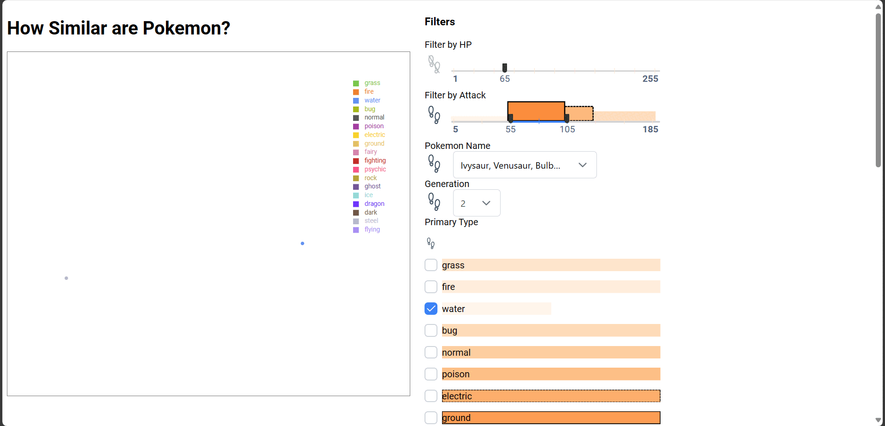
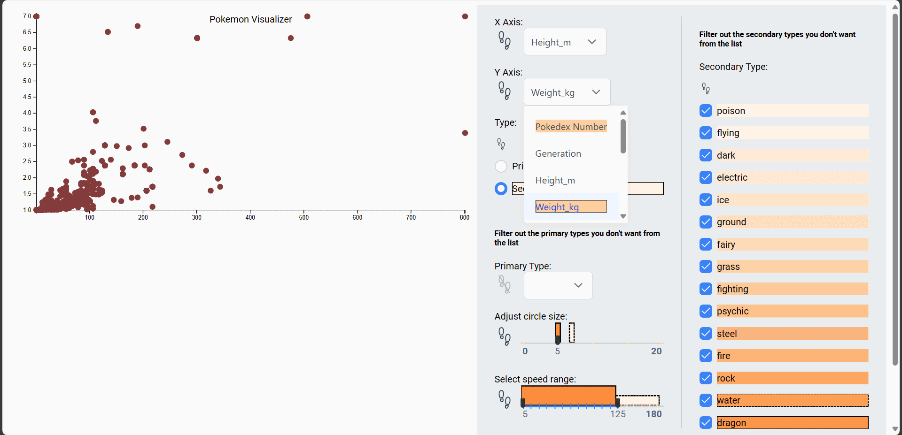
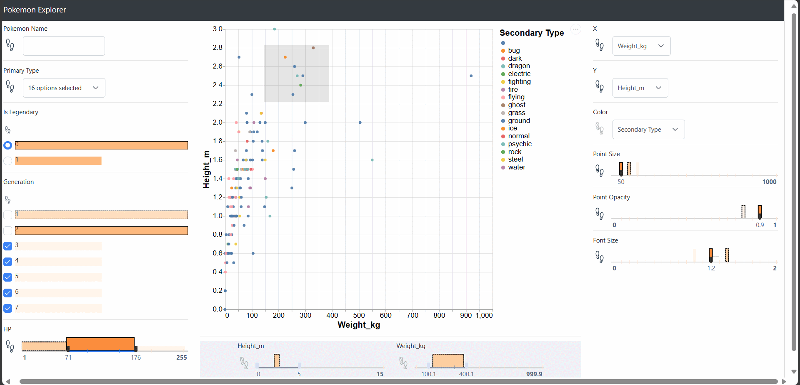

# Developer Case Studies

In this directory, we present supplementary material for case studies with developers who utilized ProvenanceWidgets to create custom applications from ground-up. The task is described in the [TASK.md](./TASK.md) file in detail, and the starter code is provided in the [starter_code/angular_starter_code](./starter_code/angular_starter_code/README.md) and [starter_code/vanilla_starter_code](./starter_code/vanilla_starter_code/README.md) directories.

## Developed Applications

### Participant P1

Participant P1 developed their [application](./participant_code/p1/README.md) using Angular. They made a scatter plot, and used ProvenanceWidgets for:

- Configuration:
    - Axes: Dropdowns (Numerical attributes of Pokemon)
    - Label (Color): Dropdown (Categorical attribute of Pokemon)
- Filtering:
    - Axes values: Range sliders

### Participant P2

Participant P2 developed their [application](./participant_code/p2/README.md) using vanilla JS and Web Components. They made a scatter plot that visualizes the output of a UMAP dimensionality reduction algorithm that groups similar Pokemon together. The pokemon can be filtered by:

- HP: Single Slider
- Attack: Range Slider
- Pokemon Name: Multiselect
- Generation: Dropdown
- Primary Type: Checkbox
- Secondary Type: Radio Button

### Participant P3

Participant P3 developed their [application](./participant_code/p3/README.md) using vanilla JS and Web Components. They made a scatter plot with configurable axes (dropdowns) and point size (slider). They also added filters for:

- Type: Radio Button
- Speed: Range Slider
- Primary Type: Multiselect
- Secondary Type: Checkbox

### Participant P4

Participant P4 developed their [application](./participant_code/p4/README.md) using Angular. They made a scatter plot, and used ProvenanceWidgets for:

- Configuration:
    - Axes: Dropdowns (Numerical attributes of Pokemon)
    - Color: Dropdown (Categorical attribute of Pokemon)
    - Point size: Single Slider
    - Point opacity: Single Slider
    - Font size: Single Slider
- Filtering:
    - Pokemon Name: Text Input
    - Primary Type: Multiselect
    - Is Legendary: Radio Button
    - Generation: Checkbox
    - HP: Range Slider

They also implemented vis-to-widget binding by adding a brush to the scatter plot, which updates the Defense and Attack range sliders.

